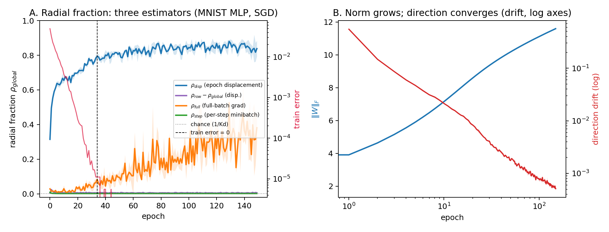

# 3. E1 — the decomposition measured

**Figure 1.** MNIST, 784→256 MLP with bias-free linear head, plain SGD
(lr 0.1), 150 epochs, 3 seeds. **A.** The radial fraction ρ_global under three
estimators, with train error overlaid (red, log scale, right axis): epoch
displacement (blue) climbs from 0.3 to ~0.87; the full-batch gradient
(orange) rises late and noisily to 0.3–0.5; the per-step minibatch estimator
(green) never leaves the noise floor (dotted: chance, 1/Kd). The ρ_row −
ρ_global gap (purple) stays below 0.01. **B.** ‖W‖_F grows 1.8 → 11.6 without
plateau while the windowed direction drift ‖Ŵ(t) − Ŵ(t−k)‖ (red, log-log)
decays as a clean power law.

## Predictions

Registered before the run (P1–P5): the head norm grows without bound; ρ stays
bounded away from 1 pre-separation and inflects upward toward 1 when train
error reaches zero, with the inflection aligned to the separation epoch;
direction drift decays consistent with Soudry et al.'s O(1/log t) rate;
the mean ρ over the final quarter exceeds 0.5; ρ_row ≥ ρ_global everywhere.

## Results

**Norm grows, structure freezes (P1, P3: pass).** ‖W‖_F grows 6.4× with no
plateau (3.0% relative growth in the final quarter; the falsification
threshold was < 1%). Test accuracy is flat at 98.2–98.3% throughout.
Responsibility entropy collapses from 0.26 to 0.0022 nats. The loss buys
confidence only. The drift decays from 0.55 to 0.0005 with log-log slope
−0.98/−0.98/−1.05 (seeds 0/1/2). This is quantitatively the Soudry rate: if
Ŵ(t) converges like 1/log t, the k-step windowed difference scales as
k/(t log²t), slope −1 up to log corrections. We present this as validation of
the instrument against the known theorem, not as a finding.

**Late travel is radial (P4: split verdict).** Mean ρ_global over the final
quarter, by estimator: epoch displacement **0.846** (pass), full-batch
gradient 0.321 (fail against the registered 0.5), per-step minibatch 0.0016
(noise floor). Parameter motion is overwhelmingly radial; instantaneous loss
reduction is only one-third radial at epoch 150, because direction
convergence is logarithmic and the residual tangential gradient largely
cancels within each epoch. Stated plainly: at 150 epochs, training *moves*
almost purely radially, while the loss is still partly reduced by residual
tangential refinement. The estimator hierarchy itself (Section 2.4) emerged
from this experiment, via amendment A1: the originally registered per-step
estimator is provably the wrong instrument, and its noise-floor reading is
reported as the contrast, not hidden.

**No separation-aligned inflection (P2: fail).** ρ_disp rises smoothly from
epoch 0 (0.31 → 0.68 by epoch 10) and shows no inflection at the
zero-train-error epoch (~34). The registered prediction assumed the binary
regime split of Section 2.2; the data enforce the weighted version. The MLP
is at ~95% train accuracy after one epoch, so the responsibility-weighted
scale derivative favors growth almost immediately — only 5% of examples
oppose it. The refined statement: radial dominance tracks the weighted
correct fraction, not the zero-error time. A test on a late-separating task
remains open (Section 9).

**Nesting and the gap (P5: pass).** ρ_row ≥ ρ_global at every one of ~210k
logged comparisons. The gap is nonzero but small — 0.006 (displacement),
0.031 (full-batch) — so per-component volume drift exists but global
temperature is the dominant juicing channel. This single number anticipates
two later results: E2's row and global constraints behave identically, and
post-hoc temperature scaling (one global parameter) suffices empirically in
the calibration literature.

The biased-head sensitivity arm (joint (W, b) projection) reproduces every
number above within noise (ρ_disp 0.866; ‖W‖ → 11.6); the bias-free canonical
setting is a convenience, not a crutch. Per-seed estimator curves:
[fig_e1_estimators.png](fig_e1_estimators.png).
