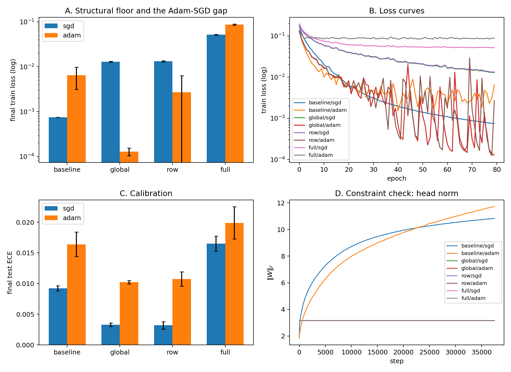

# 4. E2 — the intervention

E1 is correlational. E2 removes the radial degree of freedom and watches what
the loss does without it.

**Figure 2.** Same MNIST MLP, 80 epochs, 3 seeds, SGD (lr 0.1) and Adam
(lr 1e-3). Arms: baseline; *global* (‖W‖_F of the head projected to √10 after
every step — a fixed global temperature); *row* (head rows projected to unit
norm); *full* (row constraint plus the body layer's (W1, b1) jointly projected
to its init norm). **A.** Final train loss (log). **B.** Loss curves. **C.**
Final test ECE. **D.** Constraint check: the head norm is exactly pinned in
all constrained arms while the baseline grows to ~12.

All constraints are post-step projections of the iterate, not weight-norm
reparametrizations. The distinction matters to optimization-side readers:
projection leaves the gradient field untouched and removes the degree of
freedom from the iterate; reparametrization changes the gradient geometry via
the chain rule. We test the former.

## Results

| arm | opt | final train loss | test acc | test ECE |
|---|---|---|---|---|
| baseline | sgd | 0.0007 | 0.9824 | 0.0092 |
| baseline | adam | 0.0065 | 0.9806 | 0.0164 |
| global | sgd | 0.0129 | 0.9826 | **0.0033** |
| global | adam | 0.0001 | 0.9838 | 0.0102 |
| row | sgd | 0.0133 | 0.9823 | **0.0032** |
| row | adam | 0.0027 | 0.9833 | 0.0107 |
| full | sgd | 0.0519 | 0.9791 | 0.0165 |
| full | adam | 0.0876 | 0.9707 | 0.0199 |

**The causal claim holds where the constraint actually binds (P6: pass for
SGD).** Under either head constraint, SGD's train loss plateaus at a
structural floor 18× above baseline while test accuracy is unchanged and ECE
improves 64–65%. Removing the scale channel removes the late loss descent and
removes the overconfidence, and costs nothing structural. The row and global
arms are statistically indistinguishable in every metric — the per-row volume
freedom adds nothing beyond global temperature (P8 answered; consistent with
E1's gap of 0.006).

**Scale leaks, and Adam finds the leak (amendment A2).** Under the same head
constraints, Adam reaches *lower* train loss than its own unconstrained
baseline (10⁻⁴ vs 6.5×10⁻³). The body — one Linear+ReLU layer — is positively
homogeneous, so it re-creates the scale degree of freedom the head constraint
removed, and Adam drives through it. The loss curves (panel B) show Adam's
constrained runs oscillating violently around 10⁻⁴ while SGD sits at its
floor. This was registered as a risk ("deep-network scale leakage") and is
hereby promoted to a result: a constraint on one layer of a homogeneous
network is not an intervention on the function's scale. It also previews E3:
the two optimizers respond to the same residual channel with completely
different appetites.

**Closing the leak overshoots (the dial, first appearance).** The full arm
floors both optimizers — but accuracy drops (0.3% SGD, 1.0% Adam) and ECE
*worsens* relative to baseline. The body projection binds structural
directions too: feature learning needs body norm growth, and a model pinned
below the confidence its accuracy warrants is miscalibrated in the
under-confident direction. The best calibration in the study is head-only
constraint + SGD (ECE 0.0033): the radial channel suppressed at the output,
features left free. Volume control is a dial, not a switch — E4 meets the
same law from the other side.

One registered prediction could not be evaluated here. P7 expected the
Adam-vs-SGD final-loss gap of the predecessor SAE paper to close under the
constraint; but the anomaly's premise (Adam reaching lower loss at baseline)
does not reproduce in this supervised testbed — baseline SGD's loss is 10×
lower than Adam's. The anomaly belongs to the SAE objective, and Section 5
follows it there.
