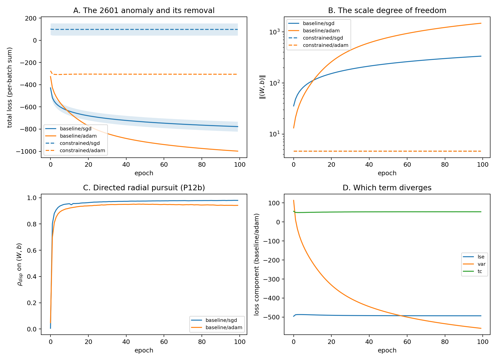

# 5. E2b — the exact case: the SAE anomaly is the volume term

The predecessor paper (arXiv:2601.06478) trained a decoder-free sparse
autoencoder — a single Linear(784→64)+ReLU encoder under
LSE + variance + decorrelation losses — and reported an anomaly it could not
explain: Adam reaches roughly 50% lower loss than SGD, indefinitely, at
identical feature quality. This section shows the anomaly is the volume term
of Section 2.6, in closed form, and removes it.

## The closed form

Under a → αa, generated exactly by jointly scaling the encoder's (W, b)
(ReLU is positively homogeneous):

- the decorrelation term is scale-invariant (correlations do not change);
- the LSE term saturates: ReLU sparsity pins min_j a_ij = 0 per example, so
  log Σ_j exp(−α a_ij) → log(#inactive units), a constant;
- the variance term pays forever: −Σ_j log var(α a_j) = −2K log α − const.

The objective therefore contains a persistent radial descent direction whose
payout is logarithmic in scale: −2K log α with K = 64. InfoMax controls the
activation distribution's shape; the scale is unpriced. Note the contrast
with cross-entropy, where the radial payout collapses to an
exponentially-vanishing gradient after separation. This difference selects
the transport mechanism in Section 6.

**Figure 3.** Faithful minimal reimplementation (their architecture, losses,
data pipeline, and optimal learning rates: SGD 0.01, Adam 1e-3; 100 epochs;
seeds {1,2,3}). **A.** Baseline losses descend indefinitely (Adam steeper);
constrained arms (‖(W, b)‖ projected to its init value each step) are flat
from epoch 1. **B.** The scale DOF: baseline ‖(W, b)‖ grows to 335 (SGD) and
1479 (Adam); constrained arms hold 4.6. **C.** The epoch-displacement radial
fraction on (W, b) exceeds 0.94 for *both* optimizers. **D.** The diverging
loss component is the variance term, as the closed form requires.

## Results

| arm | opt | final loss | ‖(W,b)‖ | ρ_disp | probe acc |
|---|---|---|---|---|---|
| baseline | sgd | −777.3 ± 45 | 335 | 0.98 | 0.9192 |
| baseline | adam | −998.5 ± 0.6 | 1479 | 0.94 | 0.8943 |
| constrained | sgd (lr 0.003) | −285.9 ± 26 | 4.6 | — | 0.9333 |
| constrained | adam | −305.6 ± 0.1 | 4.6 | — | 0.9360 |

**The anomaly reproduces exactly (P12a: pass).** Baseline Adam reaches
−998.5 ± 0.6 against the original repository's documented −999 ± 1 for the
same configuration.

**The scale-accounting closes it (P12, P7).** Adding the predicted volume
payout back to each baseline loss — loss + 2K log(‖Wb‖_end/‖Wb‖_init) — puts
Adam at −260 ± 1 and SGD at −228 ± 42: the same range. Adam's entire
advantage was climbing the scale axis further (α = 321× vs 73×); 74% of its
total loss depth is the −2K log α payout. Under the constraint, with the
learning rate re-tuned for the fixed-norm manifold (0.003; the
unconstrained-optimal 0.01 stalls, and *larger* rates are worse — projection
plus large steps acts as noise injection on the sphere), the raw Adam−SGD
floor gap is 20, i.e. **9% of the baseline gap**, inside the registered 25%
criterion. P7 passes on its intended testbed.

**Features improve (P12d).** Linear-probe accuracy: constrained Adam 0.936
and constrained SGD 0.933 are the two best feature sets in the study, above
both baselines. Removing the juicing channel is not a tax on quality here; it
is a subsidy. The anomaly never was about features.

**Both optimizers advect (P12b: pass).** ρ_disp > 0.94 for SGD *and* Adam —
unlike the CE testbed, where Adam's displacement was 0.3% radial. When the
radial direction pays persistently, both optimizers pursue it directionally.
This is the second half of the transport-mechanism claim that Section 6
states in full.

A methodological caveat worth one sentence in any intervention study:
constraining the iterate changes the geometry the learning rate was tuned
for; transferring the unconstrained-optimal rate manufactured a spurious
optimizer gap until the sweep corrected it.
