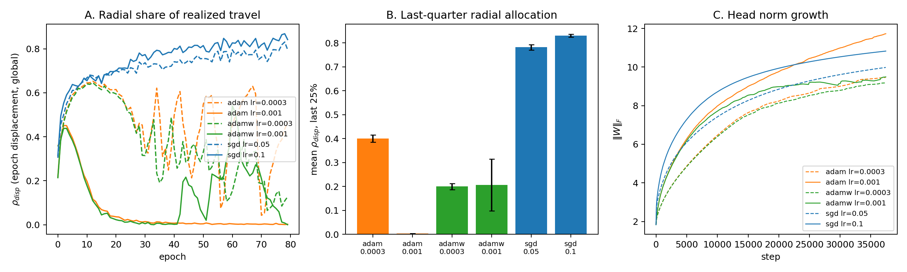

# 6. E3 — two transport mechanisms

We registered a mechanism and the data refuted it. The registered prediction
(P9): the radial gradient is small but persistent; SGD's step length scales
with gradient magnitude and ignores it; Adam normalizes magnitude away and
pursues it; therefore Adam allocates a larger share of its realized step to
the radial direction. Every cell of the grid shows the opposite.

**Figure 4.** Same MNIST MLP, 80 epochs, seeds {0,1,2}; SGD lr {0.05, 0.1},
Adam lr {3e-4, 1e-3}, AdamW lr {3e-4, 1e-3}. **A.** Radial share of realized
travel (epoch-displacement ρ_global): SGD climbs to ~0.8 and stays; Adam and
AdamW start near 0.5–0.65 and collapse. **B.** Last-quarter means. **C.**
Head norm growth: comparable endpoints by different roads.

| opt | lr | ρ_disp (last 25%) | Δ‖W‖²/epoch (late) | ‖W‖ end |
|---|---|---|---|---|
| sgd | 0.1 | 0.831 | 0.42 | 10.8 |
| sgd | 0.05 | 0.782 | 0.48 | 10.0 |
| adam | 3e-4 | 0.401 | 0.49 | 9.5 |
| adam | 1e-3 | **0.003** | **1.06** | 11.7 |
| adamw | 3e-4 | 0.200 | 0.42 | 9.2 |
| adamw | 1e-3 | 0.206 | 0.27 | 9.5 |

## The replacement mechanism

Both optimizers juice; they juice through different channels of the identity
Δ‖W‖² = 2⟨W, ΔW⟩ + ‖ΔW‖² (Section 2.5).

**SGD: advection.** Its step length tracks gradient magnitude. As the
direction converges (E1: drift → 0 at the Soudry rate), the tangential
gradient dies and the persistent radial signal is what remains. SGD's
realized motion becomes almost purely radial — not because it seeks scale,
but because it follows the gradient, and post-separation the gradient points
along W.

**Adam: diffusion.** Per-coordinate normalization keeps every coordinate
moving at ~lr regardless of signal size. Late-training motion is dominated by
tangential churn — ρ_disp falls to 0.003 at lr 1e-3 — yet the norm grows
*faster* than SGD's (1.06 vs 0.42 per epoch, 2.5×), because tangential
displacement in 2560 dimensions inflates the norm by Pythagoras. Adam's norm
growth is a side effect of diffusion, not a pursuit of the radial gradient.
Two corollaries fall out. First, E2's leakage asymmetry: a head constraint
blocks SGD's directed channel, but Adam's diffusion immediately exploits
whatever unconstrained subspace remains. Second, baseline Adam's worse
calibration at equal accuracy (ECE 0.0164 vs 0.0092): faster norm inflation
is faster confidence sharpening.

**AdamW: partial volume control by accident.** Its decay term is the one
force in the update that points radially inward at a rate proportional to
‖W‖. It cuts the diffusive growth (0.27 vs 1.06 at lr 1e-3) and ends at the
smallest norms. This is E4's weight-decay arm, met from the optimizer side.

## The synthesis with E2b

Which mechanism dominates is selected by the objective's radial payout, not
by the optimizer alone. When the payout persists (the SAE's −2K log α
variance term), both optimizers advect: ρ_disp > 0.94 for SGD and Adam alike
(Section 5). When the payout collapses (post-separation CE, gradient
exponentially small), SGD advects by default and Adam diffuses. One
pathology, two transport mechanisms, objective-selected. To our knowledge
neither the radial-share plot (panel A) nor this selection principle appears
in the implicit-bias or calibration literatures; it is the paper's sharpest
novel claim, and it exists only because a registered prediction was allowed
to fail in public.
