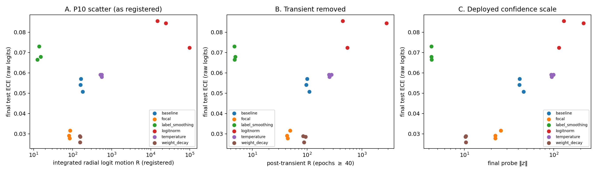

# 7. E4 — fix taxonomy

Five regularizers from the four literatures, one at a time, on the
calibration community's testbed: CIFAR-10, ResNet-18 (CIFAR stem, bias-free
head), SGD momentum 0.9, 160 epochs, seeds {0,1,2}. Arms: baseline (no
regularizer), weight decay 5e-4, label smoothing 0.1, LogitNorm τ = 0.04,
focal loss γ = 3, and a learned-then-frozen temperature (T trained jointly
for the first half, frozen for the second). All arms reach train error
≤ 0.06%: every model interpolates; they differ in what else they bought.

The registered prediction (P10): a single fix-agnostic scatter — final ECE
against integrated radial logit motion R — with Spearman ≥ 0.8. It fails:
Spearman is +0.37, and not because of one outlier arm.

**Figure 5.** Final test ECE against **A** the registered integrated radial
motion R (log scale), **B** R with the first 40 epochs excluded (removes
LogitNorm's init transient; ranks unchanged), and **C** the final probe ‖z‖ —
the confidence scale the deployed softmax actually sees.

| arm | R | final ‖z‖ | ECE | acc |
|---|---|---|---|---|
| label_smoothing | 14 | 4.3 | 0.0691 | 0.9318 |
| focal | 83 | 23 | 0.0296 | 0.9121 |
| weight_decay | 155 | 10 | **0.0278** | **0.9509** |
| baseline | 167 | 43 | 0.0540 | 0.9300 |
| temperature | 544 | 96 | 0.0588* | 0.9351 |
| logitnorm | 45825 | 153 | 0.0808 | 0.9118 |

## The U-shape

The relation between radial motion and calibration error is two-sided. The
two worst-calibrated arms sit at the two *ends* of the radial-motion axis.
Label smoothing pins ‖z‖ at 4.3 — its bounded targets cap the logit gaps —
and lands under-confident (ECE 0.069, worse than no fix at all). LogitNorm's
raw logits sit at ‖z‖ 153 and land overconfident (ECE 0.081). The
well-calibrated arms, weight decay (0.028) and focal (0.030), sit in the
middle. The registered monotone law is falsified; so is the pre-registered
fallback ("radial suppression is necessary but not sufficient"), which has
the wrong shape — suppression itself miscalibrates.

The replacement claim, post-hoc and labeled as such: **fixes calibrate
exactly insofar as they move the deployed confidence scale toward the
calibrated value.** Five heuristics are one mechanism — they price, cap, or
relocate the scale degree of freedom — and their calibration effect is the
signed distance they leave between deployed and calibrated scale. E2's full
arm found the same law in weight space (over-constraint → under-confidence);
E4 finds it in the calibration community's own benchmark.

## Two findings inside the table

**LogitNorm relocates the degree of freedom; it does not remove it.** Its
loss is scale-invariant in z, so it prices the loss-side scale exactly — and
leaves the raw, deployed scale entirely unpriced. With no weight decay in the
arm (one regularizer at a time), nothing else prices it either: ‖z‖ spikes to
~1750 in the first epochs and settles at 153. The small logit norms reported
in the LogitNorm paper come from recipes that include weight decay. The
mechanistic lesson generalizes E2's leakage result from weight space to
output space: scale must be priced in the *deployed function*, not merely in
the training objective.

**Weight decay is the best all-round volume control.** Best ECE, best
accuracy, controlled ‖z‖ — consistent with E3's observation that decay is the
one term in the update pointing radially inward in proportion to ‖W‖.

## Pending

(*) The temperature arm's ECE is currently computed on raw z, but its
deployed model includes the learned T — the harness evaluates the wrong
function for exactly the arm whose mechanism is scale division. The
deployment-corrected evaluation (`src/e4_recompute_ece.py`: ECE at the
learned T, post-hoc optimal T*, and the scale gap |log T*| per run) requires
the training-machine checkpoints; its output (`results/e4/ece_corrected.json`)
settles P11b and supplies the scale-gap x-axis on which the U-shape should
become monotone-in-|distance|. The figure and this section will be updated
when it lands.
