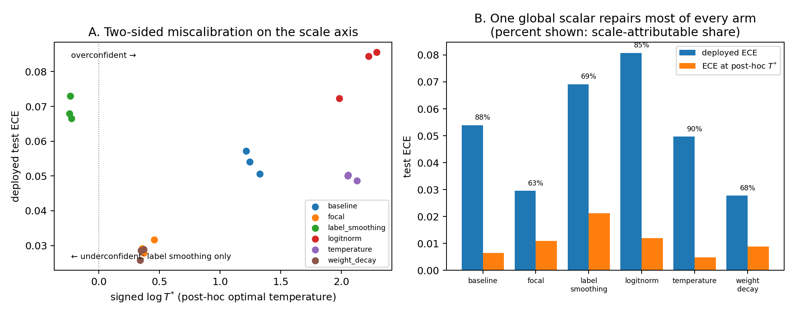

# 7. E4 — fix taxonomy

Five regularizers from the four literatures, one at a time, on the
calibration community's testbed: CIFAR-10, ResNet-18 (CIFAR stem, bias-free
head), SGD momentum 0.9, 160 epochs, seeds {0,1,2}. Arms: baseline (no
regularizer), weight decay 5e-4, label smoothing 0.1, LogitNorm τ = 0.04,
focal loss γ = 3, and a learned-then-frozen temperature (T trained jointly
for the first half, frozen for the second). All arms reach train error
≤ 0.06%: every model interpolates; they differ in what else they bought.

The registered prediction (P10): a single fix-agnostic scatter — final ECE
against integrated radial logit motion R — with Spearman ≥ 0.8. It fails:
Spearman is +0.37, and not because of one outlier arm.

**Figure 5.** Final test ECE against **A** the registered integrated radial
motion R (log scale), **B** R with the first 40 epochs excluded (removes
LogitNorm's init transient; ranks unchanged), and **C** the final probe ‖z‖ —
the confidence scale the deployed softmax actually sees.

| arm | R | final ‖z‖ | ECE | acc |
|---|---|---|---|---|
| label_smoothing | 14 | 4.3 | 0.0691 | 0.9318 |
| focal | 83 | 23 | 0.0296 | 0.9121 |
| weight_decay | 155 | 10 | **0.0278** | **0.9509** |
| baseline | 167 | 43 | 0.0540 | 0.9300 |
| temperature | 544 | 96 | 0.0588* | 0.9351 |
| logitnorm | 45825 | 153 | 0.0808 | 0.9118 |

## The U-shape

The relation between radial motion and calibration error is two-sided. The
two worst-calibrated arms sit at the two *ends* of the radial-motion axis.
Label smoothing pins ‖z‖ at 4.3 — its bounded targets cap the logit gaps —
and lands under-confident (ECE 0.069, worse than no fix at all). LogitNorm's
raw logits sit at ‖z‖ 153 and land overconfident (ECE 0.081). The
well-calibrated arms, weight decay (0.028) and focal (0.030), sit in the
middle. The registered monotone law is falsified; so is the pre-registered
fallback ("radial suppression is necessary but not sufficient"), which has
the wrong shape — suppression itself miscalibrates.

The replacement claim, post-hoc and labeled as such: **fixes calibrate
exactly insofar as they move the deployed confidence scale toward the
calibrated value.** Five heuristics are one mechanism — they price, cap, or
relocate the scale degree of freedom — and their calibration effect is the
signed distance they leave between deployed and calibrated scale. E2's full
arm found the same law in weight space (over-constraint → under-confidence);
E4 finds it in the calibration community's own benchmark.

## Two findings inside the table

**LogitNorm relocates the degree of freedom; it does not remove it.** Its
loss is scale-invariant in z, so it prices the loss-side scale exactly — and
leaves the raw, deployed scale entirely unpriced. With no weight decay in the
arm (one regularizer at a time), nothing else prices it either: ‖z‖ spikes to
~1750 in the first epochs and settles at 153. The small logit norms reported
in the LogitNorm paper come from recipes that include weight decay. The
mechanistic lesson generalizes E2's leakage result from weight space to
output space: scale must be priced in the *deployed function*, not merely in
the training objective.

**Weight decay is the best all-round volume control.** Best ECE, best
accuracy, controlled ‖z‖ — consistent with E3's observation that decay is the
one term in the update pointing radially inward in proportion to ‖W‖.

## Deployment-corrected calibration

(*) The temperature arm's raw-z ECE evaluated the wrong function: its
deployed model includes the learned T. Recomputing from checkpoints
(`src/e4_recompute_ece.py`) gives each arm's deployed ECE, the post-hoc
optimal temperature T* (Guo et al. 2017), and the ECE remaining at T*.

**Figure 6.** **A.** Deployed ECE against signed log T*: label smoothing is
the only arm on the under-confident side (T* = 0.79); all others are
over-confident. **B.** Deployed ECE vs ECE after one post-hoc global
temperature; the annotation is the scale-attributable share.

| arm | deployed ECE | ECE at T* | removable | T* |
|---|---|---|---|---|
| weight_decay | 0.0278 | 0.0088 | 68% | 1.42 |
| focal | 0.0296 | 0.0110 | 63% | 1.49 |
| temperature | 0.0497 | **0.0048** | 90% | 8.00 |
| baseline | 0.0540 | 0.0064 | 88% | 3.53 |
| label_smoothing | 0.0692 | 0.0212 | 69% | **0.79** |
| logitnorm | 0.0808 | 0.0119 | 85% | 8.80 |

Three results. **First, P11b passes as registered**: deployment-corrected,
the temperature arm improves ECE (0.0497, modestly below baseline) while
suppressing radial motion not at all — the predicted outlier to any
R-versus-ECE line. It carries a moral: the arm *learned* T = 2.39 at
mid-training and froze, but ‖z‖ more than doubled afterwards, leaving the
optimal correction at T* = 8.0. A scale fix that stops adapting is outrun by
continued juicing; post-hoc temperature scaling works precisely because it is
applied after the growth has stopped.

**Second, one global scalar repairs 63–90% of every arm's miscalibration.**
This is the study's strongest unification number, and it independently
confirms the weight-space finding that the juicing channel is global
(ρ_row − ρ_global ≈ 0.006, Sections 3–4): most of what six different training
recipes get wrong about confidence is a single temperature.

**Third, the two-sidedness is confirmed on the scale axis, and the naive
distance law is not.** The sign of log T* sorts the arms exactly as the
U-shape requires — label smoothing alone under-confident, the rest
over-confident. But deployed ECE is not monotone in |log T*|: equal scale
gaps carry different ECE (temperature 0.050 vs logitnorm 0.081 at gaps
2.1–2.2), because the confidence distribution's shape sets how much ECE a
given log-scale error costs, and because label smoothing's damage is partly
scale-irreparable — its ECE at optimal temperature (0.0212) is double every
other arm's, the signature of target-shape distortion rather than scale
error. The final form of the claim: **miscalibration decomposes into a
dominant, two-sided global-scale component and an arm-specific shape
residual; the five fixes are a dial on the first, and label smoothing also
bends the second.**
